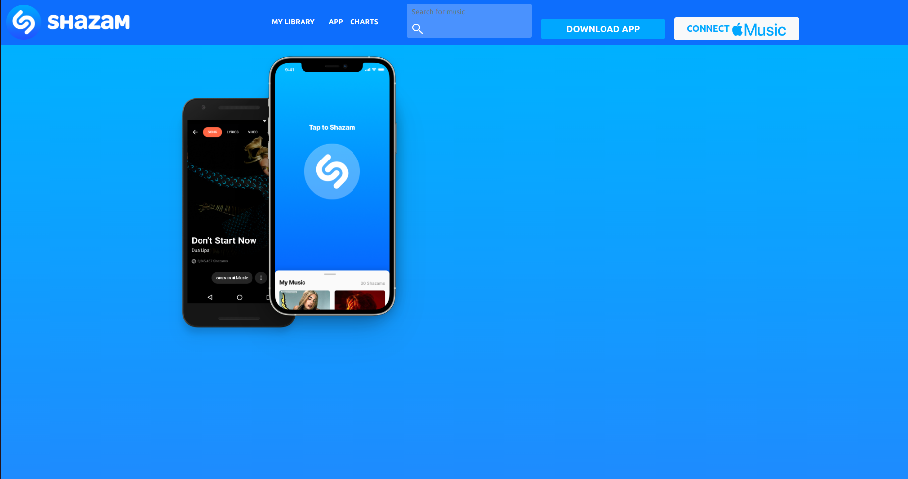

# Bootstrap SHAZAM

**[Test this app yourself](https://vincenzoarena.github.io/bootstrap-shazam/)**

---

### About Project

A not responsive clone of SHAZAM's official website made using Bootstrap as an exercise.

### How to use this Project

No functionalities on this SHAZAM's clone made with Bootstrap

##### Developed With

- [x] _HTML5_
- [x] _CSS3_
- [ ] _SASS_
- [ ] _SCSS_
- [ ] _JavaScript_
- [ ] _React_
- [x] _Bootstrap_
- [ ] _npm_
- [ ] _..._

---

### Contact

Mail: <penninoematita@gmail.com> 
GitHub: [vincenzoarena](https://github.com/vincenzoarena) 
LinkedIn: [Vincenzo Arena](https://www.linkedin.com/in/vincenzo-arena-032a064b/)

---

### Used Tools

- [Visual Studio Code](https://code.visualstudio.com/)

---